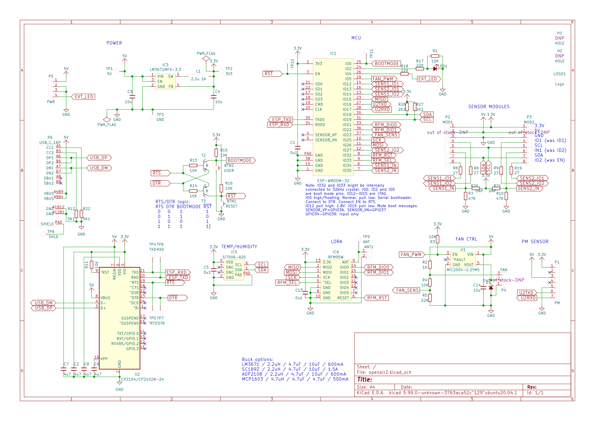

# OpenAir Hardware Plattform

This repository contains the Kicad schematics and board layouts for the
OpenAir sensor plattform, as well as the bill of materials.

# Notes for v1.5

- parts variant, USB and power/buck changed to account for availibility
- CAM files in `gerber` folder are for manfucturing with JLC
- migrated file formats to Kicad 6 in advance of version bump
